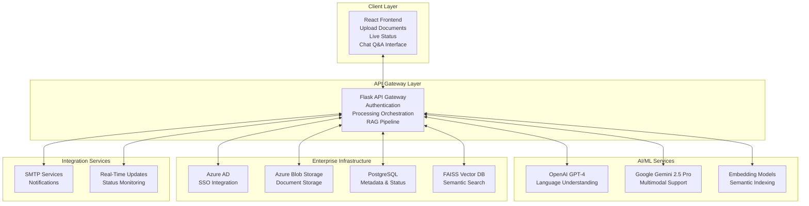

# DocuAssist: Enterprise AI Document Intelligence Solution

## Executive Summary

**DocuAssist** is an enterprise-grade AI Document Intelligence Solution Accelerator that revolutionizes how organizations manage, process, and gain insights from unstructured document data. With powerful AI models, a cloud-native architecture, and seamless enterprise integration, DocuAssist transforms static document repositories into dynamic, searchable knowledge assets.

### Key Business Benefits

* **Reduce document analysis time by up to 90%** using AI-powered automation
* **Enhance knowledge discovery** with natural language question answering
* **Accelerate application development** for document-centric workflows
* **Ensure enterprise-grade security** with Azure AD integration and secure storage

Built on a modern technology stack—React + Flask—DocuAssist is ready to scale with your organization's needs.

## Solution Architecture

The solution is designed with modularity, scalability, and security at its core.



## Core Capabilities

### Enterprise-Grade Security
* Azure AD SSO & role-based access control
* Document-level isolation
* End-to-end encryption (at rest and in transit)

### Intelligent Document Processing
* Support for PDF, DOCX, PPT, TXT, and more
* OCR-based content extraction
* Asynchronous processing with real-time status

### AI-Powered Intelligence
* Powered by LLM of your choice
* Retrieval-Augmented Generation (RAG) for contextual Q&A
* Semantic embeddings for deep document understanding

### Conversational Interface
* Natural language queries across collections
* Context-aware responses with source citations
* Fully interactive UI for exploration

### Advanced Discovery & Insights
* Vector-based semantic search (FAISS)
* Cross-document insights and linkage analysis
* Auto-summarization of key information

### Cloud-Native Architecture
* Scalable microservices infrastructure
* Event-driven design with PostgreSQL listeners
* Native integration with Azure services

## Technology Stack

| Layer              | Technology                                              |
| ------------------ | ------------------------------------------------------- |
| **Frontend**       | React 18, TypeScript, Tailwind CSS                      |
| **Backend**        | Flask (Python), PostgreSQL                              |
| **AI/ML**          | OpenAI GPT-4, Google Gemini, Custom Embedding Pipelines |
| **Storage**        | Azure Blob Storage, FAISS Vector Database               |
| **Authentication** | Microsoft Azure Active Directory                        |
| **Notifications**  | SMTP, WebSocket, PostgreSQL Listeners                   |
| **Architecture**   | Microservices, REST APIs, Event-driven Design           |


## DocumentAgent Class

The `DocumentAgent` class is the core document processing engine that handles invoice extraction, vector storage, and conversational AI capabilities.

### Key Features

#### Document Processing
- **Invoice Processing**: Extracts structured header and body data from PDF invoices
- **Text Chunking**: Automatically splits documents into manageable chunks for processing
- **Vector Storage**: Uses FAISS vector database for efficient document retrieval
- **Metadata Generation**: Creates column metadata for extracted data

#### Conversational Interface
- **RAG-based Chat**: Query processed documents using natural language
- **Context-aware Responses**: Provides answers with source citations
- **Question Suggestions**: Generates relevant questions based on processed content

#### Document Management
- **Document Summary**: Provides overview of processed invoices and content
- **Chunk Analysis**: Tracks processing statistics and document structure

### Main Methods

#### Core Processing Methods

**`process_invoice(file_path: str) -> dict`**
Processes a PDF invoice and extracts structured data.

Parameters:
- `file_path` (str): Path to the PDF invoice file

Returns:
- Dictionary containing:
  - `header-data`: Invoice metadata (invoice number, date, vendor info, etc.)
  - `body-data`: Line items and transaction details
  - `processing_info`: Statistics about chunks processed

**`generate_columns_metadata(header_data: dict, body_data: dict) -> dict`**
Generates metadata about the extracted columns and data structure.

#### Chat and Query Methods

**`chat_with_documents(message: str) -> dict`**
Enables conversational querying of processed documents using RAG.

Returns:
- Dictionary containing answer, sources, context, search type, and number of chunks used

**`suggest_questions() -> list`**
Generates suggested questions based on processed document content.

**`get_document_summary() -> dict`**
Provides summary statistics about processed documents.

### Usage Examples

#### Basic Invoice Processing

```python
from document_agent import DocumentAgent

# Initialize the agent
agent = DocumentAgent()

# Process a PDF invoice
result = agent.process_invoice("path/to/invoice.pdf")

# Access extracted data
header_data = result["header-data"]
body_data = result["body-data"]
processing_info = result["processing_info"]

print(f"Invoice Number: {header_data.get('invoice_number')}")
print(f"Total Chunks Processed: {processing_info.get('total_chunks')}")
```

#### Chat with Processed Documents

```python
# Query processed documents
response = agent.chat_with_documents("What is the total amount for invoice 12345?")

print("Answer:", response["answer"])
print("Sources:", response["sources"])
print("Chunks Used:", response["num_chunks_used"])
```

#### Generate Metadata

```python
# Generate column metadata
metadata = agent.generate_columns_metadata(
    header_data=result["header-data"],
    body_data=result["body-data"]
)
```


### API Integration

The DocumentAgent is integrated into the Flask application through several endpoints:

- **`/api/upload`**: Processes uploaded PDF invoices
- **`/api/chat`**: Enables chat functionality with processed documents
- **`/api/document-summary`**: Returns document processing summary
- **`/api/question-suggestions`**: Provides suggested questions
- **`/api/process-inbound`**: Batch processes files from inbound folder


## Implementation Workflow

### Authentication & Access Control
Azure AD SSO and access control enforcement

### Document Ingestion
* Upload via React UI
* Store in Blob Storage & index metadata in PostgreSQL

### AI Processing
* Preprocess & chunk content using DocumentAgent
* Generate embeddings with AI models
* Store in FAISS vector database for querying

### Interactive Chat Interface
* Ask natural language questions through DocumentAgent
* Get context-aware responses with citations
* Perform summarization, extraction, and comparison

### Real-time Notifications
* Processing status updates via WebSocket
* Email alerts upon task completion
* PostgreSQL notification listeners for status changes


## Data Flow

1. **Document Upload** → PDF uploaded to Azure Blob Storage
2. **Processing** → DocumentAgent extracts structured data
3. **Vector Storage** → Content stored in FAISS vector database
4. **Metadata Generation** → Column metadata created
5. **Chat Interface** → RAG-based querying of processed content
6. **Status Monitoring** → Real-time updates via PostgreSQL listeners


## Business Use Cases

| Industry                 | Use Case                                                     |
| ------------------------ | ------------------------------------------------------------ |
| **Legal & Compliance**   | Contract analysis, clause detection, regulatory audits       |
| **R&D / Innovation**     | Technical research mining, patent analysis                   |
| **Customer Support**     | AI-powered document search for manuals & FAQs               |
| **Financial Services**   | Automate financial reports, policy review, and audits       |
| **Knowledge Management** | Convert static repositories into intelligent knowledge bases |


## Professional Services & Support

DocuAssist is a **Solution Accelerator** developed by our AI Engineering team. We offer:

* Custom integrations and deployment support
* Enterprise-grade security assessments
* Developer enablement and training workshops
* SLA-backed support and managed services

> Contact us to schedule a demo or begin implementation.

> **DocuAssist** is part of the **Atlas Solution Accelerators** suite—purpose-built to fast-track enterprise AI adoption across industries.
