# 📄 DocuAssist: Enterprise AI Document Intelligence Solution

## 🚀 Executive Summary

**DocuAssist** is an enterprise-grade **AI Document Intelligence Solution Accelerator** that revolutionizes how organizations manage, process, and gain insights from unstructured document data. With powerful AI models, a cloud-native architecture, and seamless enterprise integration, DocuAssist transforms static document repositories into dynamic, searchable knowledge assets.

### 🔍 Key Business Benefits

* ⏱️ **Reduce document analysis time by up to 90%** using AI-powered automation
* 💡 **Enhance knowledge discovery** with natural language question answering
* ⚡ **Accelerate application development** for document-centric workflows
* 🔐 **Ensure enterprise-grade security** with Azure AD integration and secure storage

Built on a modern technology stack—React + Flask—DocuAssist is ready to scale with your organization's needs.

---

## 🏗️ Solution Architecture

The solution is designed with modularity, scalability, and security at its core.

```mermaid
graph TB
    subgraph "Client Layer"
        UI[React Frontend • Upload Documents • Live Status • Chat Q&A Interface]
    end
    
    subgraph "API Gateway Layer"
        API[Flask API Gateway • Authentication • Processing Orchestration • RAG Pipeline]
    end
    
    subgraph "AI/ML Services"
        GPT[OpenAI GPT-4 - Language Understanding]
        GEMINI[Google Gemini 2.5 Pro - Multimodal Support]
        EMBED[Embedding Models - Semantic Indexing]
    end
    
    subgraph "Enterprise Infrastructure"
        AAD[Azure AD - SSO Integration]
        BLOB[Azure Blob Storage - Document Storage]
        DB[PostgreSQL - Metadata Indexing]
        VECTOR[Vector DB - Semantic Search]
    end
    
    subgraph "Integration Services"
        EMAIL[SMTP Services - Notifications]
        NOTIFY[WebSockets - Real-Time Updates]
    end
    
    UI <--> API
    API <--> GPT
    API <--> GEMINI
    API <--> EMBED
    API <--> AAD
    API <--> BLOB
    API <--> DB
    API <--> VECTOR
    API <--> EMAIL
    API <--> NOTIFY
```

---

## 🧠 Core Capabilities

### 🔐 Enterprise-Grade Security

* Azure AD SSO & role-based access control
* Document-level isolation
* End-to-end encryption (at rest and in transit)

### 📄 Intelligent Document Processing

* Support for PDF, DOCX, PPT, TXT, and more
* OCR-based content extraction
* Asynchronous processing with real-time status

### 🧠 AI-Powered Intelligence

* Powered by LLM of your choice
* Retrieval-Augmented Generation (RAG) for contextual Q\&A
* Semantic embeddings for deep document understanding

### 💬 Conversational Interface

* Natural language queries across collections
* Context-aware responses with source citations
* Fully interactive UI for exploration

### 🔍 Advanced Discovery & Insights

* Vector-based semantic search (FAISS / ChromaDB)
* Cross-document insights and linkage analysis
* Auto-summarization of key information

### ☁️ Cloud-Native Architecture

* Scalable microservices infrastructure
* Event-driven design with PostgreSQL listeners
* Native integration with Azure services

---

## 🧰 Technology Stack

| Layer              | Technology                                              |
| ------------------ | ------------------------------------------------------- |
| **Frontend**       | React 18, TypeScript, Tailwind CSS                      |
| **Backend**        | Flask (Python), PostgreSQL                              |
| **AI/ML**          | OpenAI GPT-4, Google Gemini, Custom Embedding Pipelines |
| **Storage**        | Azure Blob Storage, ChromaDB / FAISS                    |
| **Authentication** | Microsoft Azure Active Directory                        |
| **Notifications**  | SMTP, WebSocket                        |
| **Architecture**   | Microservices, REST APIs, Event-driven Design           |

---

## ⚙️ Implementation Workflow

1. **🔐 Authenticate Users**

   * Azure AD SSO and access control enforcement

2. **📥 Ingest Documents**

   * Upload via React UI
   * Store in Blob Storage & index metadata in PostgreSQL

3. **🤖 AI Processing**

   * Preprocess & chunk content
   * Generate embeddings
   * Store in FAISS/ChromaDB for querying

4. **💬 Interact via Chat UI**

   * Ask natural language questions
   * Get context-aware responses with citations
   * Perform summarization, extraction, and comparison

5. **📨 Notify Users**

   * Real-time processing updates
   * Email alerts upon task completion

---

## 📈 Business Use Cases

| Industry                 | Use Case                                                     |
| ------------------------ | ------------------------------------------------------------ |
| **Legal & Compliance**   | Contract analysis, clause detection, regulatory audits       |
| **R\&D / Innovation**    | Technical research mining, patent analysis                   |
| **Customer Support**     | AI-powered document search for manuals & FAQs                |
| **Financial Services**   | Automate financial reports, policy review, and audits        |
| **Knowledge Management** | Convert static repositories into intelligent knowledge bases |

---

## 🛠️ Professional Services & Support

DocuAssist is a **Solution Accelerator** developed by our AI Engineering team. We offer:

* Custom integrations and deployment support
* Enterprise-grade security assessments
* Developer enablement and training workshops
* SLA-backed support and managed services

> Contact us to schedule a demo or begin implementation.

---

> **DocuAssist** is part of the **Atlas Solution Accelerators** suite—purpose-built to fast-track enterprise AI adoption across industries.
